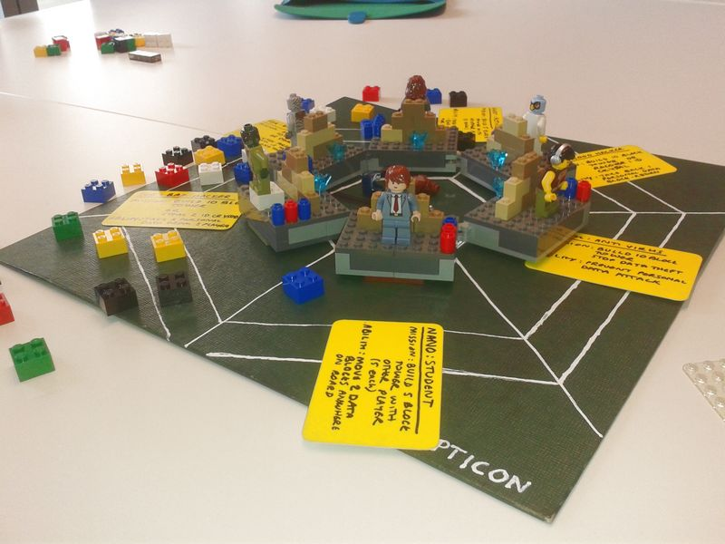

Panopticon v2 – Jan 2014
========================

Last updated by Maf'j Alvarez on February 17th 2014
This game is under creative commons attribution, share-alike licence 

Description
===========

Play Panopticon and become a data controler! build your data empire, the tallest tower from which to view the entire internet and control how content and personal data moves. You may have good intentions, or bad ones. Behind the virtual air we breathe are the people who control us – the battle for data and people’s very identities is being fought. What will YOU choose to do?

Game for 3-6 players. playing time approx 1hr

Setting up
==========

You will need the following items for the game:

3 – 6 players 

A circular panopticon board 

Spinner – made up of 6 colour positions 

Power up handhelds ( put list here) 

10 coloured 2×2 lego bricks per player in a bag 

6 Player mission cards (bad hacker, good hacker, trojan, anti-virus, activist, NGO ) 

Per player:
-----------
* 1 lego mini figure 
* 1 identity crystal 
* 6 personal data blocks (1×2 bricks) 
* base board (min 8 x 10 lego board) 
* 3 ability cards (single square brick/cylinders) 

Preparing the board
-------------------
Depending on the number of players – draw or otherwise mark equal ‘ranges’ from the middle to the edge of the board so that each player has an equal slice of the board.Put all the power up tools in the middle of the board and the spinner on the side of the board. Each player takes one player mission card without telling anyone what the mission is.

Players prepare their Panopticon bases. Each player takes a base board, picks a mini figure in turn and 3 ability cards. Take 6 personal data blocks and arrange them into a defensive wall in front of your identity crystal. Put your mini-figure and put it in front of the wall. Put your base board in the centre of the board so that your character faces outwards

Choosing your data
------------------

In turn – pick 10 coloured data pieces without looking from the bag of bits. As you draw out the bits – put them on the board in the following circles within your range – your field of vision.
* first ring: 1 bits 
* second ring: 2 bits 
* third ring: 3 bits 
* fourth ring: 4 bits 

Start of play
=============

Youngest player takes the first turn.
Spin the spinner. You need to ‘get’ a block of that colour from the board. You can only look inside your own range at the first circle. If you have that colour – take it and put it on your base board and put your mini figure on top of it. This is the start of your Panopticon tower.

Your vision with 1 block on your tower now extends to the second circle within your range.
If you don’t have the right colour and someone else does – you can make a deal. Ask the player with your coloured block in their first circle to give you theirs. The player you ask can give it to you for free, trade theirs for yours or can ask you for a personal data block for it.

If no player has that colour – move onto the next player to your left. Repeat as before.
After spinning, you can choose to play one of your ability cards and make any trade you need to help you get closer to your mission.

If you tower gets 2 blocks tall your vision now extends to the third circle. With 3 blocks it extends to 4th (last) circle. Put your mini figure on top as you get taller. You must put your blocks in order that you get them.

Winning the game
================

The winner of the game is the person who reaches their mission first.

Leaving the game / loosing control
----------------------------------

You can leave the game – or give over control of everything you have if your tower collapses or you choose to knock it down. You must then select which player to give your tower, mini-figure, personal data and id crystals to. If you choose you can stay involved in the game by commenting and making ‘helpful’ suggestions to other players.

If your ID crystal is stolen you carry on playing but are controled by the thief until end of game or until someone returns it to you.

Aquiring a tower
----------------

If someone gives you control of their data and figure – you need to put the tower blocks and personal data on your own board either on top of your own tower or beside it. You can rearrange your board however you want at this point. From now on you have 2 turns every spin – one for each minifigure.

* Blue (water) = money 
* Red (fire) = downloads/consumer products 
* Green (earth) = social media 
* Yellow (tech) = software and tools 
* Black (undead) = black/grey market 
* White (air) = information 

Player Missions
===============

Bad Hacker
Mission: Steal 2 identity crystals or be first to build a 10 block tower or 
3 ability cards: Take 1 other player to give you 1 personal data block. 

Good Hacker
Mission: Be first to build 10 block tower or wining back 1 stolen id crystal 
3 ability cards: can take back stolen personal data, and return it to their rightful owner (Sabotages Bad Hacker from winning). 

Anti-Virus
Mission: Stop data theft and build 10 block tower 
3 ability cards: Prevent a personal data block attack (can play at any time) 

Trojan
Mission: Steal 2 identity crystals or be first to build 10 block tower. 
3 ability cards: when a personal data block is taken by a player – you take one too (can play at any time) 

Activist
Mission: To build 5 block with another player who’s mission is also to get 5 blocks 
3 ability cards: Take control of bad hacker for 1 turn (play on your turn) 

Student
Mission: Mission: To build 5 block with another player who also gets 5 blocks 
3 ability cards: Move 2 data blocks from anywhere in the board to new locations (play on your turn) 

Power ups
=========

Get 3 blocks together of the same colour and you can power up – choose a power-up tool from the centre of the board and put it in the hands of your mini figure. You can use it on your next turn or on any other turn you choose.

Each power up can only be used 2 times – then it is returned to centre of board. Power ups have the following powers:

* Magic wand – Rearrange your structure for power up advantage 
* White wing – for diplomatic purposes. Take back 2 personal data blocks and redistribute 
* Chainsaw – allows you to take 1 personal data from each player (play on your turn) 
* Sword – takes 1 coloured data block from 2 players (play on your turn) 
* Owl – protects you from a player who wants to take your data (play any time) 
* Phaoah helmet – take control of 1 player for 1 round (play on your turn) 

Super power ups
---------------

* for 5 blocks in row: Slave – steal Identity crystal and take control of one player 
* for 4 blocks in row: Rescue – steal back a stolen ID crystal from another player. 
